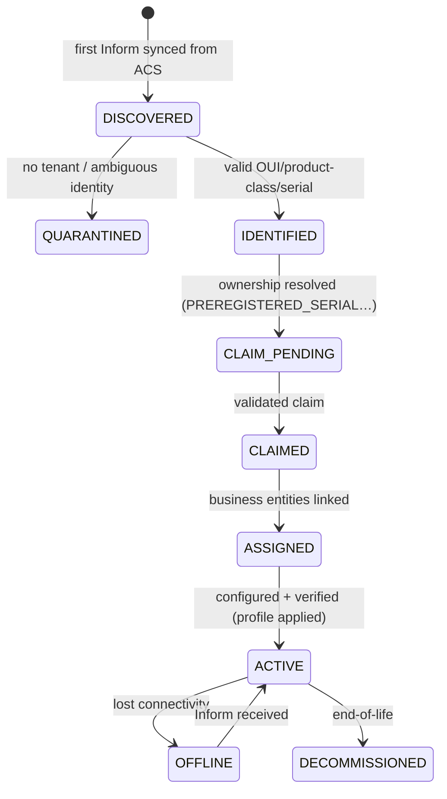

# CPE Onboarding Guide — Device Management (Milestone 7)

This guide describes how a TR-069 CPE moves from "first Inform in GenieACS"
to "claimed, assigned, configured and verified" in the
`device-management-service`.

## 1. Lifecycle overview



## 2. Prerequisites

1. GenieACS is deployed and the CPE is configured with its ACS URL
   (`Device.ManagementServer.URL`) pointing at GenieACS `:7547`.
2. The ACS instance is registered in the device-management service
   (`POST /api/device-management/acs/instances`).
3. The device is **pre-registered in inventory** (serial known) so claims can
   be validated with `PREREGISTERED_SERIAL`, or a field technician completes a
   `TECHNICIAN_INSTALLATION` claim.

## 3. Discovery

When the CPE performs its first Inform, GenieACS stores it. The control plane
pulls it in:

```http
POST /api/device-management/devices/discover
{
  "acs_instance_id": "<acs-instance-uuid>",
  "acs_device_id": "<genieacs-device-id>",
  "tenant_id": "<tenant-uuid>"
}
```

- Identity is normalized to the `(OUI, product class, serial)` tuple — the
  **only** primary identity. MACs/display names are tracked, never used as keys.
- If the device is already known, its record is touched (last-inform updated)
  and `cpe.inform_received` is recorded — no duplicate rows.
- Unknown devices are placed in **QUARANTINED** (no tenant), pending resolution.

## 4. Claim (ownership validation)

A device can only be claimed with validated ownership:

```http
POST /api/device-management/devices/<device_id>/claim?tenant_id=<tenant>
{ "method": "PREREGISTERED_SERIAL", "evidence": "<serial>" }
```

Supported resolution methods: `PREREGISTERED_SERIAL`, `ADMIN_CLAIM`,
`ONBOARDING_TOKEN`, `TECHNICIAN_INSTALLATION`, `OSS_ORDER_RESERVATION`,
`ACS_ENDPOINT`, `CIRCUIT_SERVICE_MAPPING`.

- Cross-tenant claims are rejected (`TenantIsolationError`).
- Ambiguous/unresolvable claims quarantine the device rather than guessing.
- Every resolution is recorded in `CpeOnboarding` and every claim creates a
  `CpeOwnershipHistory` row (full audit trail).

## 5. Assign

```http
POST /api/device-management/devices/<device_id>/assign?tenant_id=<tenant>
{
  "customer_id": "CUST-1",
  "service_subscription_id": "SUB-1",
  "service_location_id": "LOC-1",
  "oss_order_id": "ORD-1",
  "work_order_id": "WO-1",
  "inventory_serial": "<serial>",
  "inventory_asset_id": "INV-1"
}
```

## 6. Profile selection

Create a vendor-neutral profile, add an assignment rule, then resolve:

```http
POST /api/device-management/profiles
POST /api/device-management/profiles/<profile_id>/versions
POST /api/device-management/profiles/versions/<version_id>/approve
POST /api/device-management/profiles/versions/<version_id>/activate
POST /api/device-management/profiles/<profile_id>/assignment-rules
GET  /api/device-management/devices/<device_id>/profile-decision
```

The decision is **explainable** (which rule matched, at what priority).

## 7. Configuration job (verified)

```http
POST /api/device-management/devices/<device_id>/configuration-jobs?tenant_id=<tenant>
{ "profile_version_id": "<version>" , "verification_required": true }

POST /api/device-management/configuration-jobs/<job_id>/approve
POST /api/device-management/configuration-jobs/<job_id>/queue
POST /api/device-management/configuration-jobs/<job_id>/execute
```

The job flows `DRAFT → VALIDATING → READY → QUEUED →
CONNECTION_REQUEST_PENDING → WAITING_FOR_INFORM → EXECUTING →
DEVICE_ACKNOWLEDGED → VERIFYING → SUCCEEDED`.

- A **queued/dispatched task is never success** — the device must apply and the
  parameters must be read back.
- Offline devices stay in `WAITING_FOR_INFORM` (not failed) and the queued ACS
  task runs on the next periodic Inform.
- Read-back verification compares desired vs observed; sensitive parameters
  (Wi-Fi passwords, PPPoE, CWMP credentials) are exempt because they are
  unreadable by design.
- On success the device is `COMPLIANT`, a `DeviceConfigurationSnapshot` is
  recorded, and `cpe.configuration_applied.v1` is published.

## 8. What to do for common cases

| Situation | Behaviour |
| --- | --- |
| Serial unknown to inventory | Device quarantined; resolve via ADMIN_CLAIM or re-register in inventory |
| Device offline during config | Job waits for the next Inform; timeout via `DEVICE_MGMT_JOB_TIMEOUT_MINUTES` |
| Device reports task faulted | Job fails with the fault code; `cpe.configuration_failed.v1` published |
| Parameters not applied (task completed) | Verification fails → `VERIFICATION_FAILED`; not treated as success |
| Customer changed a value afterwards | Drift detected (`USER_CHANGE`/`SECURITY_CRITICAL`); `cpe.configuration_drift_detected.v1` |
| Inventory recovers the device | `inventory.device_recovered.v1` handler detaches inventory links |
| Field tech installs the device | `inventory.device_installed.v1` / `work_order.device_installed.v1` links the CPE |
